# Palette Generator

A plugin for [Krita](https://krita.org).

## What is Palette Generator? 
 
*PaletteGenerator* is a docker that  generates color scheme palette randomly or based of the selected scheme. 
There are 9 color scheme available togenerate from. Works best on srgb profile documents.  

---

## ScreenShots 

### *Interface*

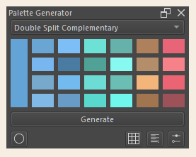
 

### *Interface Individual Parts*

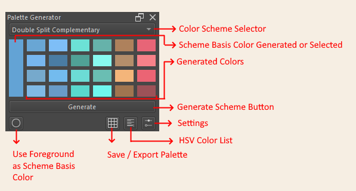

|     | Part | Description | 
| --- | ---  | --- |
| 1   | Color Scheme Selector | Choose Color Scheme that will be use in generating the palette. |
| 2   | Main/ Basis Color | The color where the palette will be based of off. this can be randomly generated or you can use the Foreground Color. |
| 3   | Generated Color Boxes | This are all the colors generated. Clicking on a box will select them as foreground color.
| 4   | Generate Button | Press this button to generate a palette |
| 5   | Use Foreground as Main Color | Uses the selected foreground color as base color for the generated palette |
| 6   | Save/ Export Palette | Save / Export Palette as KPL file. | 
| 7   | Show HSV Color List  | Show a dialog that list the HSV value of each generated colors |
| 8   | Settings             | Set the value and saturation range that will be used in generating colors |
 

*Note 1: At start the color palette slot starts as gray blocks*

*Note 2: Buttons will not respond until a canvas is created*

*Note 3: Save KPL will save it straight to krita palette folder but Krita need to be restarted to see the palette*

*Note 4: Exporting KPL and importing KPL via resource managers shows the palette in krita palette list*

*Note 5 : Color distribution depends on the scheme, Main color is generated more than second and so on."

### *Configuration Dialog*

The configuration dialog allows the customization and control of the randomization settings. 
Configuration is available for color odds and ranges, timer setting to categories and items.

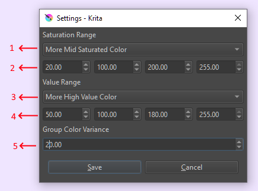

1. **Saturation Odds** : Changes the odds to favor a range of saturation 
2. **Saturation Ranges**  : Set up the ranges of saturation points
3. **Value Odds** : Changes the odds to favor a range of value 
4. **Value Ranges** : Set up the ranges of value points 
5. **Group Color Variance** : Set the variation of color within a color group

### *Value and Saturation Ranges Control* 

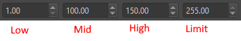 

1. Low Saturation/Value Box : Sets the lowest possible value / saturation of the color generated can have.
2. Mid Saturation/Value Box : Marks the end point of Low sat/val range and start point of Mid sat/val range
3. High Saturation/Value Box : Marks the end point of Mid sat/val range and start point of High sat/val range
4. Saturation/Value Limit Box: Sets up the highest possible value / saturation of the color generated can have.

### *Value and Saturation Odds Control*

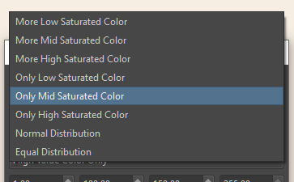 

1. More Low Saturation/Value Color - Skew the odds of generated more color to generate more low saturation or value color.
2. More Mid Saturation/Value Color - Skew the odds of generated more color to generate more mid saturation or value color.
3. More High Saturation/Value Color- Skew the odds of generated more color to generate more high saturation or value color.
4. Only Low Saturation/Value Color - Select **Only** colors in low saturation or value color.
5. Only Mid Saturation/Value Color - Select **Only** colors in mid saturation or value color.
6. Only High Saturation/Value Color - Select **Only** colors in high saturation or value color.
7. Normal Distribution - Attempts to distribute odds based on Normal Bell curve.
8. Equal Distribution  - Make the odds of generating low, high, mid saturation/value equal .

**Odds Distribution**

| Odds Skew | %Low | %Mid | %High |
|-----------|-----|-----|------|
| More Low  | 90  |  5  |  5   |
| More Mid  | 5   | 90  |  5   |
| More High | 5   | 5   |  90  |
| Only Low  | 100  |  0  |  0   |
| Only Mid  | 0   | 100  |  0   |
| Only High | 0   | 0   |  100  |
| Normal    | 14  | 72  |  14  |
| Equal     | 33  | 34  |  33  |

- Even if the odds is skewed to low there is still 10% chance of getting color with higher saturation/value. 

### *Save Export KPL*

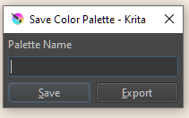

1. Palette Name  
2. Save         - Directly Save palette to Krita Palette folder, needs to restart krita to show on krita palette list 
3. Export       - Export palette to a directory of your own choosing. You can import it to krita via resource manager. 
Importing this way will make it show up int the palette list immediately.

  
**Sample Color Palette Generated By Color Scheme**
- Note that color generated in each level is also dependent on the range setup as low, mid, high. 
- Only Monochromatic is not affected by this. The gray tones in Accented Achromatic are not affected as well
- Theres is a slight wiggle room (-2 to -5, +2 to +5 hue) from the base color to the generated color. Making sure colors are close but are still different.  

**Monochromatic**

*This scheme is not affected by value and saturation odds and ranges* 

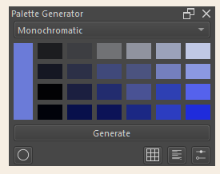

Accented Achromatic

*Generates One Key color, and a bunch of gray tone, gray leaning neutral colors. 

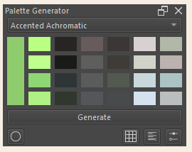

**Analogous**

*Generates Color that are nearby each other in the color wheel

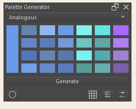

**Complementary**

*Generates Color that are opposite in the color wheel*
*This is the only scheme, not counting the main color, with equal generated color distribution*

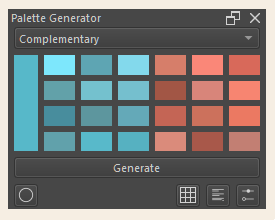

**Split Complementary**
*Generates Color one color and colors that are nearby the opposite color in the color wheel*

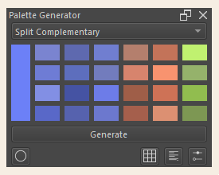

**Double Split Complementary**

*Generates two sets of complementary color*
*this is limited to only color near each other and their opposite.15 to 60 deg apart. * 

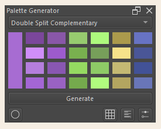

**Triadic**

*Generates 3 group of colors that are of equal distance to each other. 120 deg apart each other.*

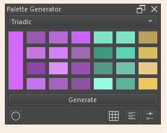

**Tetradic Square** 

*Generates 4 group of colors that are of equal distance to each other. 90 deg apart each other.*

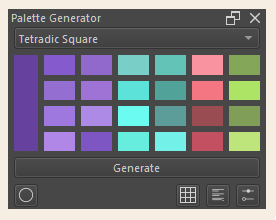

**Tetradic Rectangle** 

*Generates 4 group of colors, similar to Double Split, but are more 2 same side distance.*

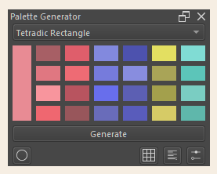

**Other Sample Color Scheme : Pastel and Low Value/ Low Saturation**

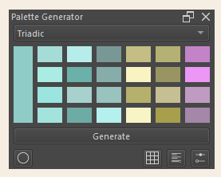 
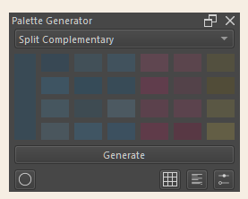

**Sample With Group Color Variance at 40** 
*Higher Color Variance results in more color*

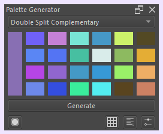

### Functionalities

This plugin main function  are;
 
1. Generate a color pallete based of a selected color scheme.
2. Save palette as kpl    
 

[Video Palette Generator in Action](https://drive.google.com/file/d/1ADQ_XU4Yjgyn-OUfrI9FJOPRlLT3hJeI/view?usp=sharing)

### Notes
 - This plugin utilizes HSV color model in  generating color.  
 - Limit for color box is 24 + 1 Main Color
 - Color Distribution varies depending on scheme and number of generated color groups. 
    - 1 color group : All boxes is for 1 color
    - 2 color group : Equal distribution
    - 3 color group : 12 more Main color, 8 for Secondary, 4 for Tertiary
    - 4 color group : 8 for Main, 8 for Secondary, 4 for Tertiary, 4 Quaternary 

### Plans 
 - Fix Saving to automatically update palette list

### Bugs and Known Issues
 

## Downloads - Install - Execute 

### Download
- **[ZIP](https://github.com/kaichi1342/PaletteGenerator/archive/refs/heads/v.0.1.3b.zip)**
- **[Source](https://github.com/kaichi1342/PaletteGenerator)**

### Install

1. Open [Krita](https://krita.org)
2. Got to Tools -> Scripts -> **Import Python Plugins** and select 

**PaletteGenerator.zip** archive. 
3. Restart [Krita](https://krita.org)
4. Make sure Palette Generator is enabled in Plugin Manager. 
if not enable it by going to Settings -> Configure Krita -> **Python Plugin Manager** and click to check **Palette Generator**.
5. Restart Krita.
6. View **Palette Generator** to your screen by going to Settings -> Dockers -> **Palette Generator**

### Tested Platforms
- Krita 5.1.4

### Release Log

2023-09-09  : Version 0.1.3b
- Change setupColor to use MangeColor.fromQcolor

2023-01-06  : Version 0.1.0
- First Released Version  

2023-01-06  : Version 0.1.1 
- Add group color variance setting
- Allow dialog to popup on left when docker is on right side of screen

2023-04-23 : Version 0.1.2
- Fix bug on color missing color variance setting

2023-08-21 : Version 0.1.3
- remove datetime in random.seed

## License

### *Palette Generator* is released under the GNU General Public License (version 3 or any later version).

*Palette Generator* is free software: you can redistribute it and/or modify 
it under the terms of the GNU General Public License as published by
the Free Software Foundation, either version 3 of the License, or
(at your option) any later version.                               
    
*Palette Generator* is distributed in the hope that it will be useful,
but WITHOUT ANY WARRANTY; without even the implied warranty of
MERCHANTABILITY or FITNESS FOR A PARTICULAR PURPOSE.
See the GNU General Public License for more details.

You should have received a copy of the GNU General Public License
along with this program. If not, see https://www.gnu.org/licenses/                                   
